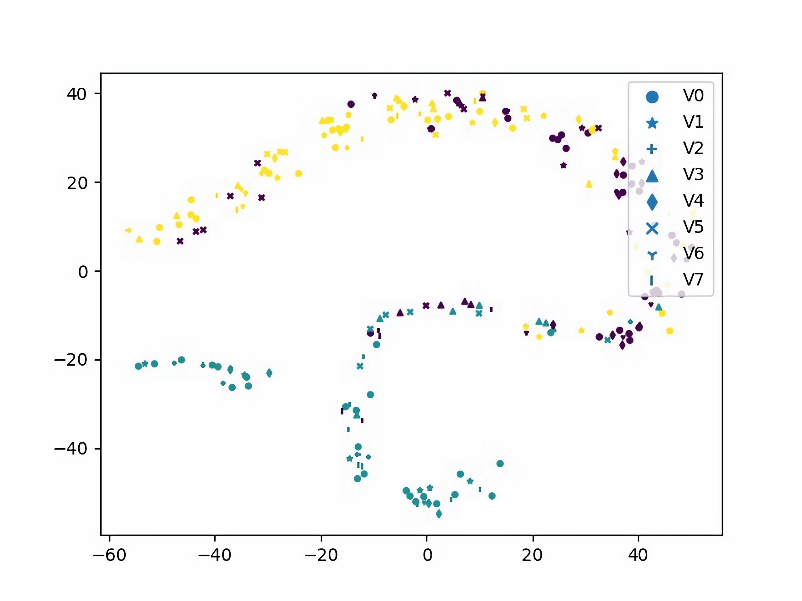
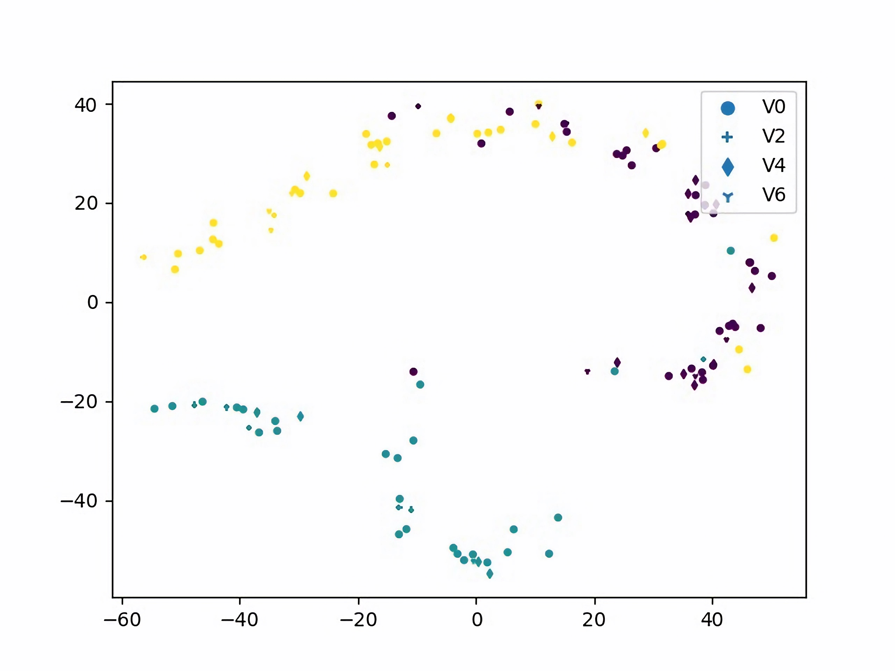
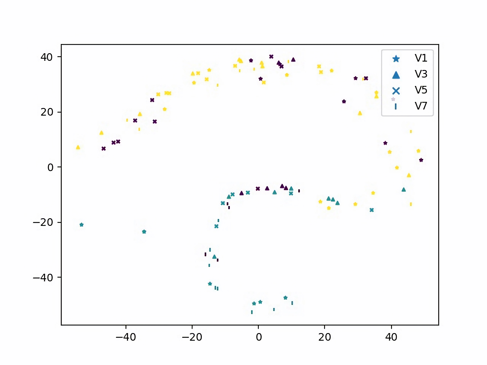

# View-Semantic Fisher Contrastive Learning for View-Invariant Skeleton-based Action Recognition(VS-FCL)

This code is part of the paper: *View-Semantic Fisher Contrastive Learning for View-Invariant Skeleton-based Action Recognition*
***
The view change is a serious challenge for extracting invariant representation for action analysis due to occlusion and deformation. To address this problem, we propose a View-Semantic Fisher Contrastive Learning (VS-FCL) for view-invariant action representation and recognition. The VS-FCL consists of two components, View-term Fisher Contrastive Learning (V-FCL) and Semantic-term Fisher Contrastive Learning (S-FCL), where V-FCL propels view disentanglement for obtaining view-invariant action representation and S-FCL drives the semantic disentanglement to seek effective semantic-oriented representation for accurate action
recognition. Besides, we introduce the Spatio-Temporal Cross-View Representation (ST-CVR) learning to capture view-interactive action features to fuse action information from different views, so as to guarantee obtaining view-invariant representation and improving recognition accuracy. Extensive and fair
evaluations are conducted on the UESTC, NTU 60, NTU 120, and Northwestern-UCLA datasets. The experiment results show that our proposed approach achieves outstanding performance on all datasets for view-invariant action recognition.
***   

##  View-Semantic Fisher Contrastive Learning (VS-FCL) Results
The VS-FCL results include two sub-parts: View-term FCL (V-FCL) and Semantic-term FCL (S-FCL).

### Visualization
Here, we 

<!-- <figure class="third">
    
    <figcaption>这是图片1的标题</figcaption>
    
    <figcaption>这是图片2的标题</figcaption>
    
    <figcaption>这是图片3的标题</figcaption>
</figure> -->

 - Sample 1：View-common representation obtained by V-FCL(3 classes)
 <figure class="third">
    
    <!-- <figcaption>这是图片1的标题</figcaption> -->
    
    <!-- <figcaption>这是图片2的标题</figcaption> -->
    
    <!-- <figcaption>这是图片3的标题</figcaption> -->
</figure>

<!-- |View-common Representation|||<mg src="./bigjpg/f-c-3_3.jpg" width="200">
|:-:|:-:|:-:| -->

