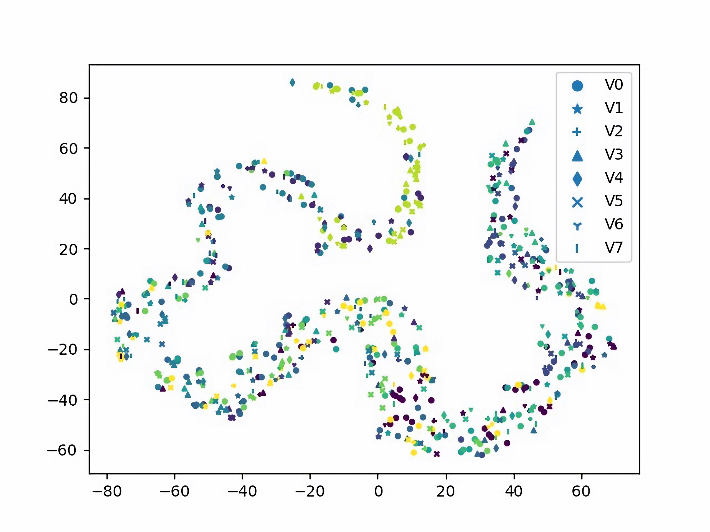
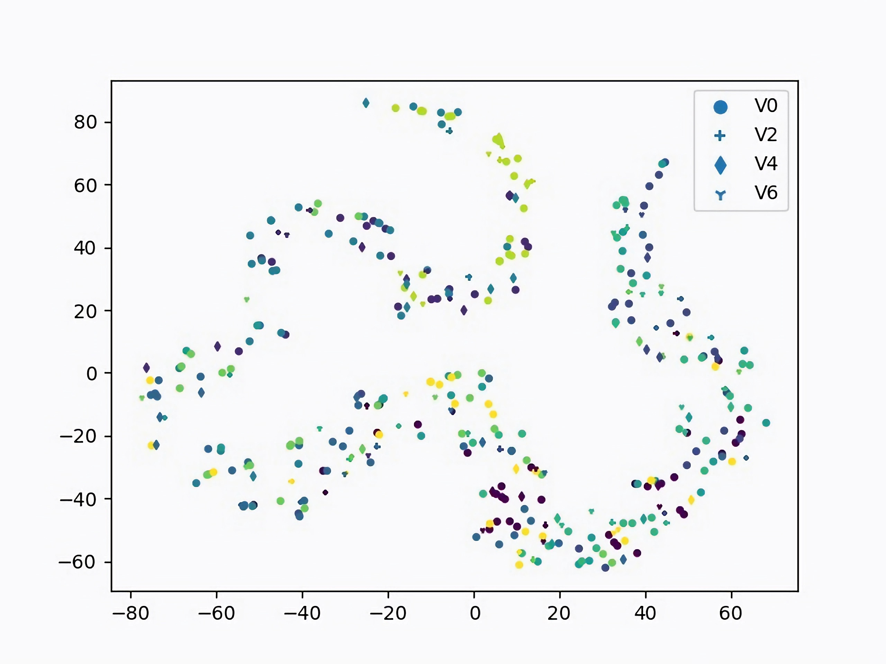
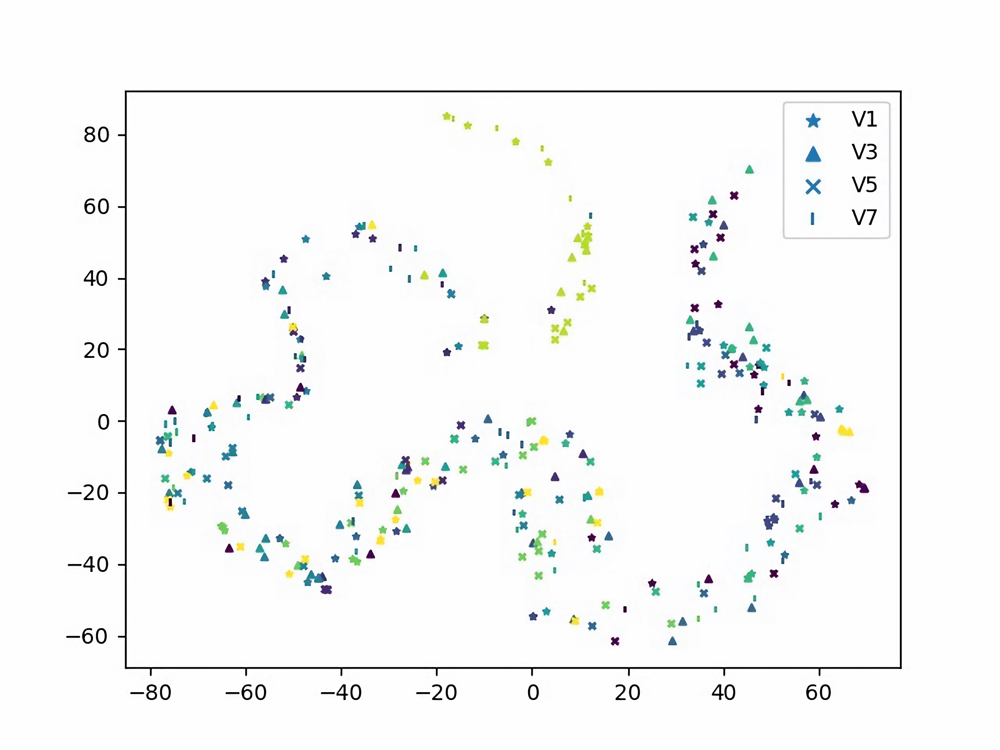
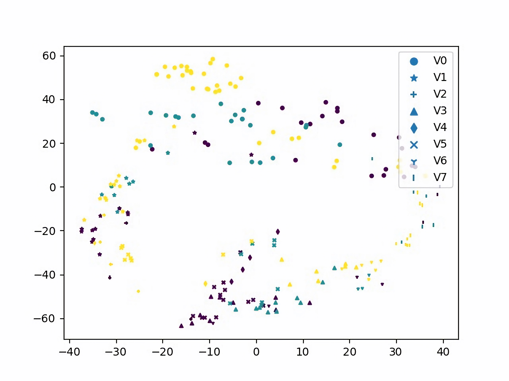
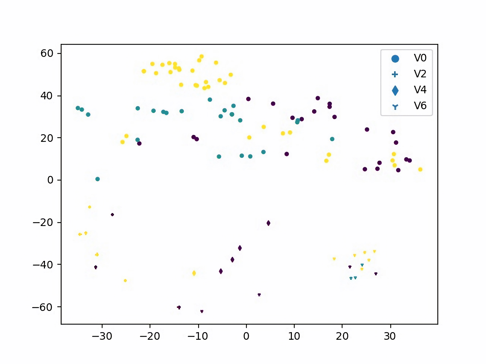
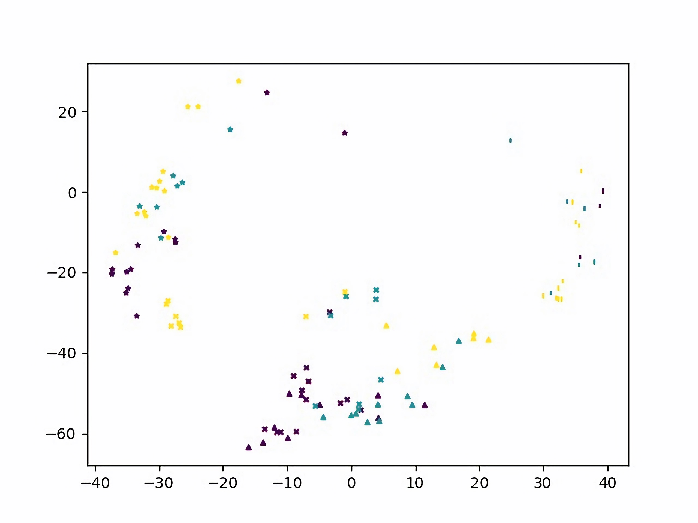
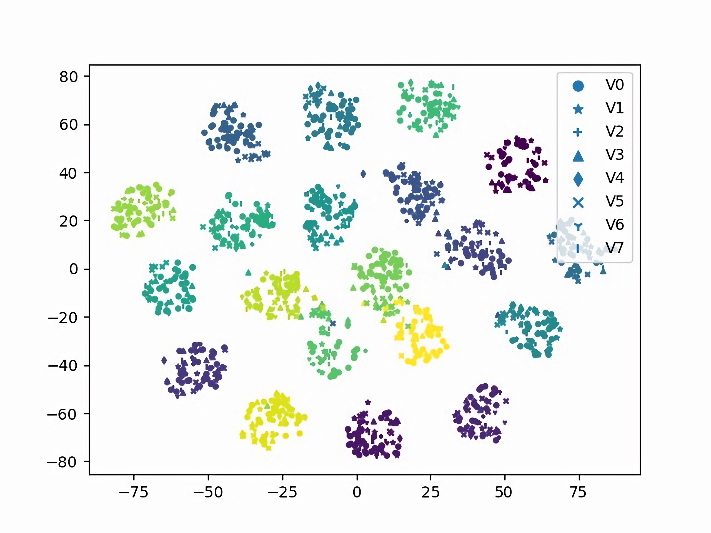
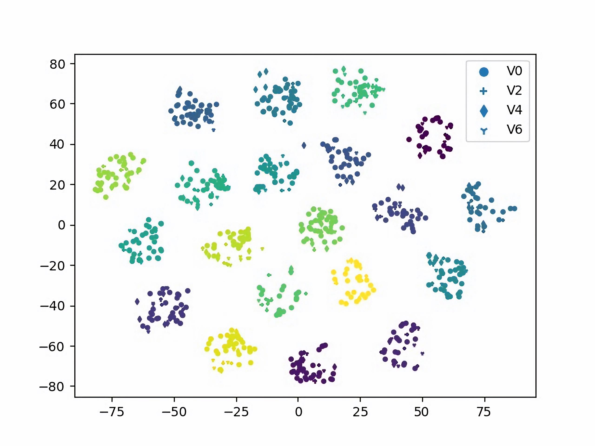
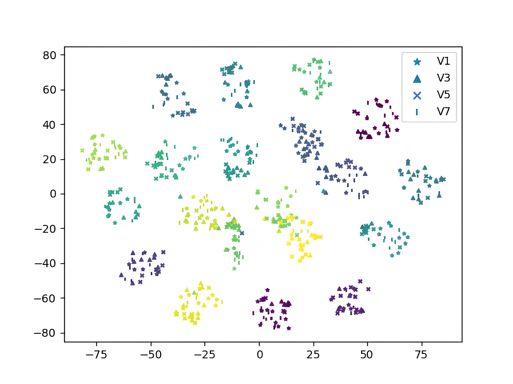

# View-Semantic Fisher Contrastive Learning for View-Invariant Skeleton-based Action Recognition(VS-FCL)

This code is part of the paper: *View-Semantic Fisher Contrastive Learning for View-Invariant Skeleton-based Action Recognition*
***
The view change is a serious challenge for extracting invariant representation for action analysis due to occlusion and deformation. To address this problem, we propose a View-Semantic Fisher Contrastive Learning (VS-FCL) for view-invariant action representation and recognition. The VS-FCL consists of two components, View-term Fisher Contrastive Learning (V-FCL) and Semantic-term Fisher Contrastive Learning (S-FCL), where V-FCL propels view disentanglement for obtaining view-invariant action representation and S-FCL drives the semantic disentanglement to seek effective semantic-oriented representation for accurate action
recognition. Besides, we introduce the Spatio-Temporal Cross-View Representation (ST-CVR) learning to capture view-interactive action features to fuse action information from different views, so as to guarantee obtaining view-invariant representation and improving recognition accuracy. Extensive and fair
evaluations are conducted on the UESTC, NTU 60, NTU 120, and Northwestern-UCLA datasets. The experiment results show that our proposed approach achieves outstanding performance on all datasets for view-invariant action recognition.
***   

##  View-Semantic Fisher Contrastive Learning (VS-FCL) Results
The VS-FCL results include two sub-parts: View-term FCL (V-FCL) and Semantic-term FCL (S-FCL).

The V-FCL is presented to assist view disentanglement for generating view-common
and view-specific action representations.Bring closer the common viewpoint features of the same category, and separate the unique viewpoint features of the same category.

Base on the V-FCL, The Semantic-term FCL (S-FCL) propels semantic disentanglement to learn semantic-oriented action representations.

### Visualization
Here, we  provide the t-SNE visualization of feature distributions learned by the VS-FCL algorithm in the UESTC dataset. Different colors and markers
represent different actions and viewpoints.(Except for the Sample 5, we use color to represent viewpoints to visualize the discriminative effect of different viewpoints.)

<!-- <figure class="third">
    
    <figcaption>这是图片1的标题</figcaption>
    
    <figcaption>这是图片2的标题</figcaption>
    
    <figcaption>这是图片3的标题</figcaption>
</figure> -->
- Sample 1：Distribution of original action representation

 - Sample 2：View-common representation obtained by V-FCL(3 classes)

<!-- |View-common Representation|||<mg src="./bigjpg/f-c-3_3.jpg" width="200">
|:-:|:-:|:-:| -->

- Sample 3：View-common representation obtained by V-FCL(10 classes)

- Sample 4：View-specific representation obtained by V-FCL(3 classes)

- Sample 5: View-specific representation obtained by V-FCL(1 class)

- Sample 6：semantic-oriented representationobtained by S-FCL

